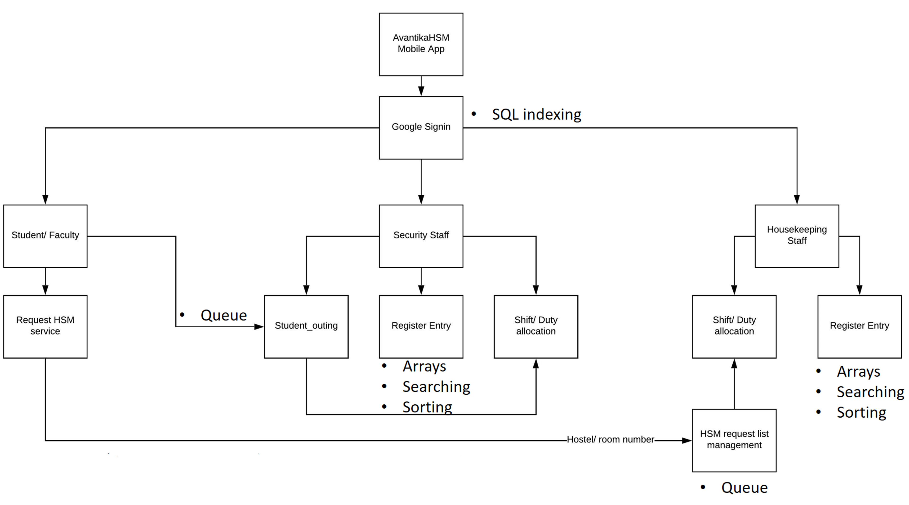
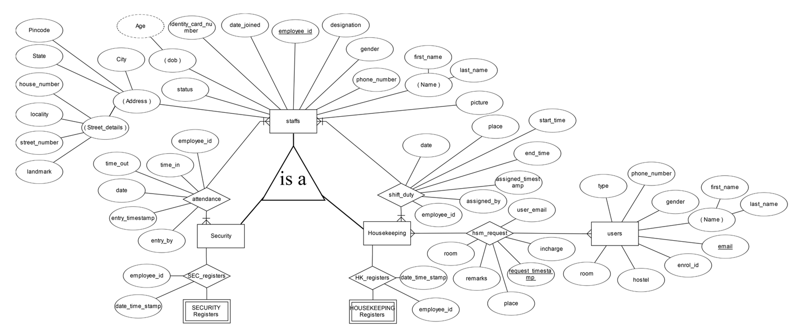
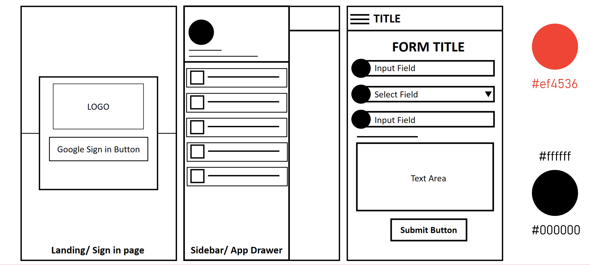

# Avantika HSM mobile application

### Housekeeping and Security management

##### Flutter, Dart, PHP, MySQL

Avantika HSM (Housekeeping and security management system) is a mobile application developed using Flutter (Google's mobile development framework) for both IOS and Android developed for Avantika University's Housekeeping and security staff and campus hostel residing students. The mobile application uses PHP MySQL powered API for its functioning and integration with Avantika HSM web application.

###### Flow:

The following flow was taken and modified from AvantikaHSM web application for the development of this mobile application:

###### Entity-Relationship diagram:

The following ER model was designed and used for the application:

###### Wireframes:

This application is backed by PHP and MySQL powered API's for its functioning which aren't exposed in this repository taking into consideration the internal working factors of Avantika University.

____

## Flutter: Getting Started

#### Project Name: hsm (used for building)

This project is a starting point for a Flutter application.

A few resources to get you started if this is your first Flutter project:

- [Lab: Write your first Flutter app](https://flutter.io/docs/get-started/codelab)
- [Cookbook: Useful Flutter samples](https://flutter.io/docs/cookbook)

For help getting started with Flutter, view our 
[online documentation](https://flutter.io/docs), which offers tutorials, 
samples, guidance on mobile development, and a full API reference.